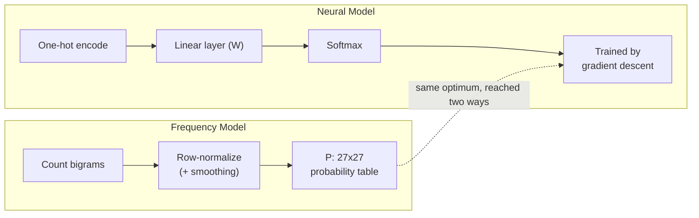

# CharPulse — Character-Level Bigram Language Model

A character-level language model built from scratch, trained to generate new names character by character.

The project implements the same idea two ways: a classical **frequency-count model**, and a **neural network** trained with gradient descent — and shows that, given enough training, the neural model converges toward the same distribution the frequency table gets by direct counting.

This project follows Andrej Karpathy's "makemore" lecture series (the bigram video), using the same `names.txt` dataset, implemented and worked through myself, then refactored into standalone modules and extended with L2 regularization.

## 🧠 What is a Bigram Model?

A bigram model predicts the next character based only on the current character. Given `emma`, with `.` marking the start/end boundary (`.emma.`), the model learns transitions:

```text
. -> e
e -> m
m -> m
m -> a
a -> .
```

These relationships are represented as a 27×27 matrix — 26 letters plus the boundary token `.` — where each row is the current character and each column is the probability of the next one.

## ⚙️ Two Approaches, Same Problem

**1. Frequency-Based Bigram Model** (`frequency_model.py`)
Count how often each character follows another across the whole dataset, then normalize each row into a probability distribution (with add-1 Laplace smoothing so no bigram has exactly zero probability).

**2. Neural Network Bigram Model** (`neural_model.py`)
The same relationship, learned instead of counted: a one-hot encoded input character passes through a single linear layer, and softmax turns the output into a probability distribution over the next character. Trained via gradient descent to minimize negative log-likelihood, with an L2 penalty playing the same smoothing role the frequency model gets from Laplace smoothing.



## 📁 Project Structure

```text
CharPulse/
├── dataset.py          # Vocabulary (stoi/itos) + bigram extraction, shared by both models
├── frequency_model.py  # Counting, smoothing, NLL evaluation, generation
├── neural_model.py     # One-hot -> linear -> softmax, training loop, generation
├── train.py             # Runnable entry point: trains + evaluates + generates from both
├── names.txt             # Training data (one name per line)
├── bigram.ipynb           # The original step-by-step notebook walkthrough
├── practice.ipynb         # Earlier scratch/practice notebook
└── requirements.txt
```

`bigram.ipynb` and `practice.ipynb` are left exactly as they were — they're the exploratory, cell-by-cell notebooks this project was built in. `dataset.py`, `frequency_model.py`, `neural_model.py`, and `train.py` are a standalone, importable/runnable refactor of the same logic, for anyone who wants to use or read the project without opening a notebook.

## 🏋️ Training

For every character pair, the current character is the input and the next character is the target:

```text
Input:  . e m m a
Target: e m m a .
```

Loss is negative log-likelihood — the probability the model assigns to the actual next character, averaged over the dataset and made positive/minimizable via `-log(...)`:

```python
loss = -probs[torch.arange(num), ys].log().mean() + reg * (W ** 2).mean()
```

Gradients come from PyTorch autograd (`loss.backward()`), and the weight update is plain gradient descent:

```python
W.data += -lr * W.grad
```

## 🔮 Generation

After training, either model can generate new names by walking the learned transition distribution one character at a time, starting and stopping on `.`:

```text
Start at "." -> predict next-character probabilities -> sample one character
   -> feed it back in as the next input -> repeat -> stop when "." is sampled
```

## ⚡ Quickstart

```bash
pip install -r requirements.txt
python train.py
```

```text
[Frequency model] negative log-likelihood: 2.4544
[Frequency model] samples: ['cexze.', 'momasurailezitynn.', 'konimittain.', 'llayn.', 'ka.']

[Neural model] loss after 100 steps: 2.4901 (started at 3.7686)
[Neural model] samples: ['cexze.', 'momasurailezityha.', 'konimittain.', 'llayn.', 'ka.']
```

Note how close the neural model's converged loss (2.49) lands to the frequency model's exact NLL (2.45), and how similar their generated samples are — that's the core idea of the project made concrete: a trained linear layer + softmax can recover essentially the same distribution a direct frequency count gets by construction.

Or use the pieces directly:

```python
from dataset import load_words, build_vocab
from neural_model import build_dataset, NeuralBigramModel

words = load_words("names.txt")
stoi, itos = build_vocab(words)

xs, ys = build_dataset(words, stoi)
model = NeuralBigramModel(vocab_size=len(stoi))
model.train(xs, ys, epochs=200, lr=50.0)

print(model.generate(itos, num_samples=10))
```

## 🧩 Concepts Covered

- Character-level language modeling
- Frequency-based probability models & Laplace smoothing
- One-hot encoding, matrix multiplication, softmax
- Negative log-likelihood / cross-entropy
- Autograd, backpropagation, gradient descent
- L2 regularization
- Probability-based sampling for generation

## Acknowledgements

Built while following Andrej Karpathy's "makemore" series, using the same `names.txt` dataset, then implemented end-to-end myself and refactored into reusable modules with additional experiments in L2 regularization.
